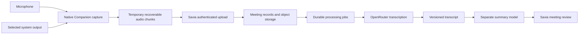

# Companion architecture and research

> Phase 2 update (2026-10-03): see [recording sessions](long-recording-next-phase.md)
> for one-hour capture, native draft recovery and durable processing. Short-sample
> limits and earlier verification results below describe the preceding increment.

Owner: Savia platform maintainers. Reviewed: 2026-10-01.
Status: target architecture; the bounded implementation is tracked in [implementation status](implementation-status.md).

## Recommended boundary

Keep one Companion project in `apps/companion`. Evaluate Tauri 2 with React and
TypeScript for controls, and Rust for platform capture and a bounded temporary
spool. Native adapters use CoreAudio on macOS and WASAPI on Windows. Reuse narrowly
audited permissive components rather than forking an entire meeting product.

Local recording is independent from network availability. Upload, STT and summary
have distinct failure states. The desktop holds no OpenRouter provider secret.
The backend enforces tenant ownership, quotas and retention and owns saved meetings.
A native temporary spool is needed for offline recording and interrupted uploads;
it is not a second authoritative meeting database. Define encryption, capacity,
expiry, deletion and logout behavior before shipping it. Browser localStorage or
IndexedDB must not become persistent meeting or configuration storage.

## Native capture

| Initial target                         | Candidate                                                     | Validation requirement                                                                 |
| -------------------------------------- | ------------------------------------------------------------- | -------------------------------------------------------------------------------------- |
| macOS 14.2+, Apple Silicon first       | CoreAudio process taps for output; separate microphone stream | Permission declarations/prompts; audible output and mic; signed build test.            |
| Windows 11 x64 first                   | WASAPI shared-mode render endpoint loopback and input capture | Chosen endpoint, exclusive/device errors, Windows privacy settings and device changes. |
| macOS Intel / Windows 10 / Windows ARM | Additional validation targets                                 | Separate hardware/build results before support claims.                                 |
| Linux                                  | Deferred                                                      | Audio backend and distribution decision in a future scope.                             |

Apple's [CoreAudio tap sample](https://developer.apple.com/documentation/CoreAudio/capturing-system-audio-with-core-audio-taps)
requires macOS 14.2 or later and a system-audio usage declaration. Microsoft's
[WASAPI loopback documentation](https://learn.microsoft.com/en-us/windows/win32/coreaudio/loopback-recording)
describes capturing a render endpoint's mixed output. It can include notifications
and other applications. Per-process Windows capture is a separate capability with
its own [minimum build requirements](https://github.com/microsoft/Windows-classic-samples/blob/main/Samples/ApplicationLoopback/README.md).
Do not advertise application isolation in the first endpoint-loopback proof.

Mic and system audio are two sources, not two speakers: several remote people can
share the output source. Preserve source identity, monotonic offsets, discontinuities
and original sample rates. Resample deliberately and measure drift. Headsets can
reduce acoustic bleed but cannot replace echo and duplicate-speech tests. UI meters
must detect sustained silence; successful API initialization alone is insufficient.

A browser-only implementation is not the baseline. Audio availability in
[getDisplayMedia](https://developer.mozilla.org/en-US/docs/Web/API/MediaDevices/getDisplayMedia)
depends on browser, OS and the shared surface. It cannot establish uniform whole
system capture. An Electron fallback also requires native/macOS capture validation;
its [desktop capture documentation](https://www.electronjs.org/docs/latest/api/desktop-capturer)
should be checked against a pinned runtime before implementation.

## OSS reuse options

Capture-product candidates remain research references. Tauri is now used by the validation shell; see the workspace dependency notices for installed native components.

| Candidate                                                         | License evidence                                                                                                              | Proposed use / limitation                                                                                                                                         |
| ----------------------------------------------------------------- | ----------------------------------------------------------------------------------------------------------------------------- | ----------------------------------------------------------------------------------------------------------------------------------------------------------------- |
| [Anarlog](https://github.com/fastrepl/anarlog) (Hyprnote lineage) | [Licensing map](https://github.com/fastrepl/anarlog/blob/main/LICENSING.md): community paths MIT; enterprise paths commercial | Strong reference for Tauri/Rust native capture. Audit the full transitive crate graph; modules are not independent copy/paste libraries. Exclude enterprise code. |
| [Meetily](https://github.com/Zackriya-Solutions/meetily)          | [Community license](https://github.com/Zackriya-Solutions/meetily/blob/main/LICENSE.md)                                       | Compare UX/capture approach; prove the exact branch's Windows capture. README platform claims alone do not pass G1.                                               |
| [Tauri](https://github.com/tauri-apps/tauri)                      | MIT or Apache-2.0 upstream                                                                                                    | Candidate desktop shell; signing, WebView dependencies and native adapters remain our work.                                                                       |
| [whisper.cpp](https://github.com/ggml-org/whisper.cpp)            | MIT upstream                                                                                                                  | Later local or self-hosted STT engine; model weights and language quality require separate review.                                                                |
| [sherpa-onnx](https://github.com/k2-fsa/sherpa-onnx)              | Apache-2.0 upstream                                                                                                           | Later streaming/local speech candidate; model licenses are separate from runtime licenses.                                                                        |

Before copying code, record immutable source commit, files, local modifications,
license text, notices, dependencies and redistribution obligations. No Anarlog or Meetily implementation has been imported; the native adapters are new project code. Savia retains its existing
[repository license](../licensing.md); permissive upstream licensing does not
relicense the whole product. Final branding must retain repository attribution.

## Deployment comparison

| Option                                  | Advantage                              | Work and cost                                                                            | Decision                                                                       |
| --------------------------------------- | -------------------------------------- | ---------------------------------------------------------------------------------------- | ------------------------------------------------------------------------------ |
| Native Companion + Savia + remote STT   | Avoids operating ML hardware initially | Capture, uploads, service integration, provider usage fees                               | Recommended first proof.                                                       |
| Same capture + dedicated VPS STT        | Runtime/provider control               | Capacity sizing, model downloads, CPU/GPU, queues, upgrades, availability and monitoring | Revisit after measured benchmarks; a cheap CPU VPS is not assumed fast enough. |
| Fork a complete OSS meeting application | Existing screens and some capture code | License/path audit, upstream rebases, duplicate identity/storage, product integration    | Reference selectively before deciding to fork.                                 |
| Browser-only recorder                   | Simple delivery                        | Platform-dependent output capture and permissions                                        | Insufficient as the cross-platform baseline.                                   |

## Savia integration seams

- `apps/api/src/assistant/configuration.ts`: reuse provider configuration and
  encrypted credential patterns. Add an STT capability/catalog separately from
  tool-capable text model filtering.
- `apps/api/src/assistant/service.ts`: useful provider client patterns, but its
  interactive assistant policies and output limits should not define a meeting
  summary job. Design a dedicated structured summarization operation.
- `packages/studio-server/src/operations.ts`: current file upload patterns must
  not buffer multi-hour recordings in `arrayBuffer()`. Implement bounded chunks
  and authenticated streaming/resumable object uploads with measured memory use.
- `packages/studio-server/src/workflows/runtime.ts`: durable status/lease/retry
  patterns can inform processing. Meeting jobs, idempotency and provider billing
  reconciliation still require implementation.
- `apps/api/wrangler.jsonc`: provision any queue/consumer/DLQ explicitly; this
  design does not assume a Cloudflare Queue is already bound.

Cloudflare Workers are an orchestration/upload boundary, not a native speech
model host. Respect documented [Worker resource limits](https://developers.cloudflare.com/workers/platform/limits/)
and validate peak memory including concurrent requests. Follow the configured
persistence backend; support D1/R2 and self-hosted adapters through repository
interfaces rather than adding desktop database credentials.

Persist meeting ownership, session state, chunk manifest, source/time range,
checksum, format, object key, processing attempts, transcript versions and summary
versions. These are conceptual requirements; the API reference remains generated
from the implementation's OpenAPI definitions. Do not treat this document as an
implemented endpoint specification.

## OpenRouter feasibility constraints

Use the dedicated STT endpoint and discover transcription models separately.
Keep uploaded pieces independently decodable, below the tested provider limit,
and retain absolute time offsets. Timestamp and speaker output are capability
specific. Measure Spanish accuracy, segmentation and actual usage costs.
The [official STT guide](https://openrouter.ai/docs/guides/overview/multimodal/stt)
was checked against the bounded adapter on 2026-10-01; discover available models
and recheck behavior before a live validation run.

Provider routing/privacy policy must be verified specifically for STT. Do not
assume chat routing controls pin a transcription provider. If a tenant's policy
cannot be satisfied, block submission or select an explicitly verified alternative.
Treat timeout after submission as an ambiguous billed attempt: local idempotency
prevents duplicate stored results but cannot guarantee the upstream avoids charging
for a retry. Cancellation stops future work; it may not reverse an accepted request.

Summary generation uses a separate text model and a structured output schema for
facts, decisions, proposed actions and unresolved questions. Preserve evidence
references to transcript versions and time ranges. Never invent attendee identities,
deadlines or commitments. Meeting text is untrusted input, not permission to execute
tools. Human review precedes creating tasks or writing to external systems.

## Bounded compressed sample implementation

The current validation capture encodes stopped source tracks locally as mono
Ogg/Opus at a target 32 kbps. MIT-licensed ruopus and MIT/Apache-2.0 Rubato avoid
a runtime FFmpeg dependency. Temporary PCM is removed after encoding; only the
bounded compressed capture remains in native memory until discard/exit.

Saving and transcription are independent explicit actions. Save validates the
container and persists an owner-private R2 object with authoritative metadata.
The native host forwards only allowlisted Savia operations using a memory-only
Savia access token; the provider key remains on the server. Transcription forwards
validated compressed bytes with `input_audio.format: "ogg"`, a format listed in
[OpenRouter's STT guide](https://openrouter.ai/blog/tutorials/transcription-on-openrouter/).
Live selected-model compatibility, billing and quality remain unverified.

The server provider adapter binds its default `fetch` transport to `globalThis`.
Cloudflare requires that receiver; invoking a detached fetch as an adapter method
throws an illegal-invocation error before contacting OpenRouter and is reported
as `PROVIDER_UNAVAILABLE`. Injected test transports are supplied explicitly.

R2 uses a hashed principal prefix plus client-generated UUID. Conditional writes
prevent replacement; content hashes distinguish idempotent retries from conflicts.
List/download/delete derive the same prefix from the authenticated principal.
Active tenant members of any role and platform administrators can access their
owner-private recordings. Accounts without an active membership are rejected.
Short native captures retain their 60-second/512 KiB limits; imported recordings
accept up to 50 MB without a duration cap. Shared tenant meeting records, jobs,
retention and quotas require the later epics.
