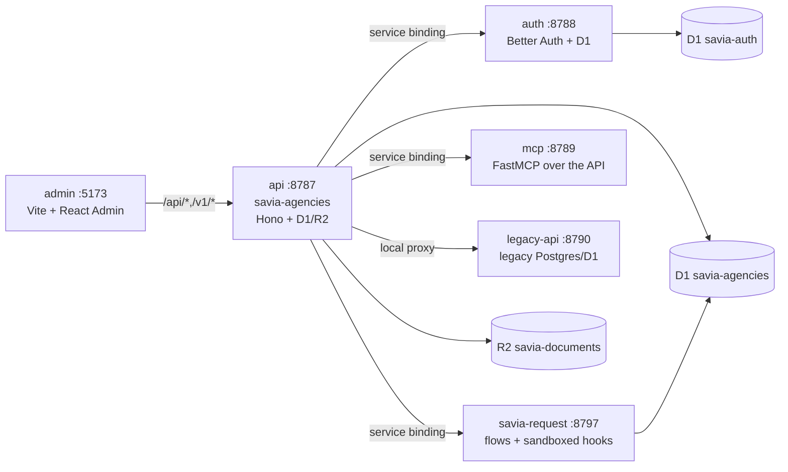

# 02 — Architecture (45 min)

pnpm monorepo (`apps/*`, `packages/*`). Five production Workers plus the
frontend; everything else (legacy, old providers) is history — see
[06-glossary.md](06-glossary.md).

## Map

Local ports (see `scripts/dev-local.sh`): admin `5173` (auto-bumps if taken,
or `SAVIA_ADMIN_PORT`), api `8787`, auth `8788`, mcp `8789` (only with
`SAVIA_MCP_SHARED_SECRET`), legacy `8790`, savia-request `8797`.

## Structural decisions

- **api vs legacy-api boundary**: the core API never touches Postgres; it
  delegates legacy collections over binding/proxy. Detail:
  [legacy-api.md](../legacy-api.md).
- **Providers via savia-request**: `apps/api/src/routes/savia-request.ts`
  forwards `/v1/savia-request/*` to the worker; flows live in
  `apps/savia-request/src/server/` (`catalog.json` + `runner.ts`); user hooks
  run isolated through `LOADER` with no network (`hooks.ts`).
- **Separate auth**: Better Auth in its own worker with its own D1; the API
  validates sessions against it. Multi-tenancy via memberships (`tenants`,
  `identity_*`).
- **Data domains**: configurable objects/screens over D1/R2 with no new SQL
  tables per screen (`apps/api/src/routes/data-domains.ts`,
  `dynamic-crm.ts`).
- **MCP**: read/action surface for the assistant over the same API.

Next: [03-local-setup.md](03-local-setup.md).
